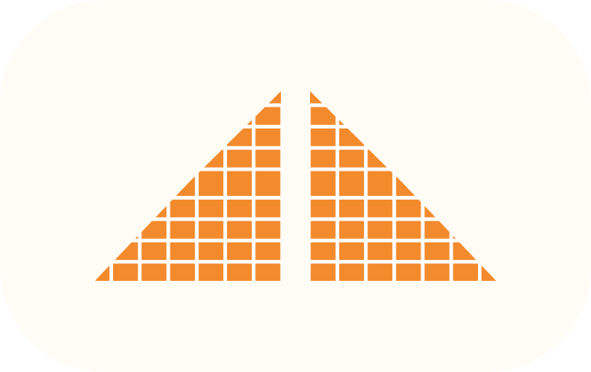
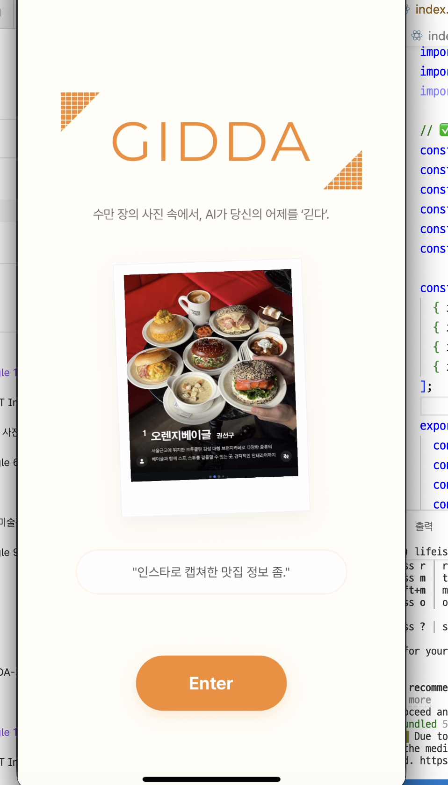

#  GIDDA (긷다) - AI 지능형 사진 관리 서비스

  
  
  
  
  
  
  
  

  

> **"기억을 긷다, 추억을 담다"**
> 사용자의 자연어 프롬프트를 분석하여 사진을 찾아주고, AI가 자동으로 앨범을 생성해주는 지능형 갤러리 서비스입니다.

---

## 📺 프로젝트 시연 영상

  

> 👆 **이미지를 클릭하면 유튜브 시연 영상으로 이동합니다!**

---

## 🚀 바로 체험하기 (Android APK)
* **[📥 APK 다운로드 (Google Drive)](https://drive.google.com/file/d/1dEKrah0hGSSi8-uru2wdd57Rcsx1d71h/view?usp=sharing)****[📥 APK 다운로드 (Google Drive)]("https://drive.google.com/file/d/1dEKrah0hGSsI8-uru2wdd57Rcsx1d71h/view?usp=sharing")**

---

## 👥 팀원 소개 (Contributors)

| 프로필 | 이름/계정 | 역할 및 담당 업무 |
| :---: | :--- | :--- |
|  | **이지현** | **PM, 아키텍처 및 파이프라인 설계**, UI/UX 디자인, 프론트엔드 총괄 |
|  | **이태경** | **AI 모델링 담당**, 지능형 검색 및 분석 알고리즘 구축 |
|  | **백지연 (Jiyeon-Back)** | **Full-Stack 개발**, 외부 API 연동 및 서비스 로직 구현 |
|  | **차명근** | **Database 담당**, DB 설계 및 검색 히스토리 관리 |
|  | **박채원** | **데이터 수집**, 모델 학습 및 서비스용 데이터 에셋 구축 |
